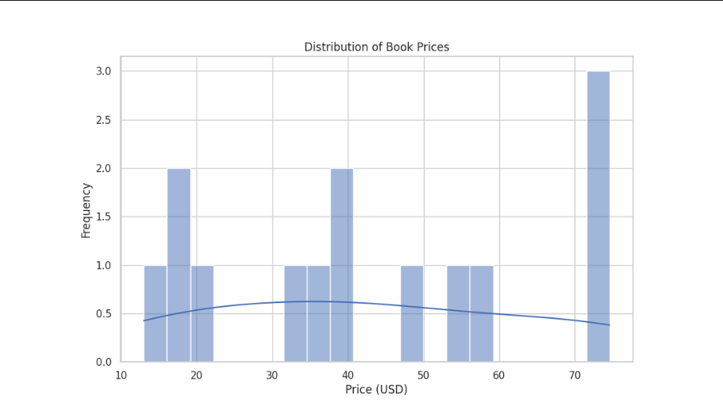

# Web Scraping Project

This project performs web scraping of a book page, extracting information about titles and prices.



## Project Structure

- `data/raw/`: Raw data.
- `data/processed/`: Processed and cleaned data.
- `notebooks/`: Jupyter notebooks for analysis and testing.
- `scripts/`: Python scripts.
  - `__init__.py`: File to initialize the package.
  - `scrape.py`: Main scraping script.
  - `utils.py`: Utility functions and helpers.
- `logs/`: Log files.
- `requirements.txt`: Project dependencies.
- `README.md`: Project documentation.
- `config.yaml`: Configuration file.

## Usage

1. Install dependencies:

    ```bash
    pip install -r requirements.txt
    ```

2. Run the scraping script:

    ```bash
    python3 -m scripts.scrape
    ```

## Configuration

Adjust the configurations in `config.yaml` as needed.
